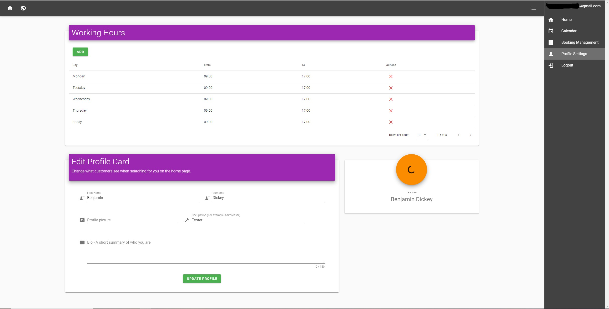
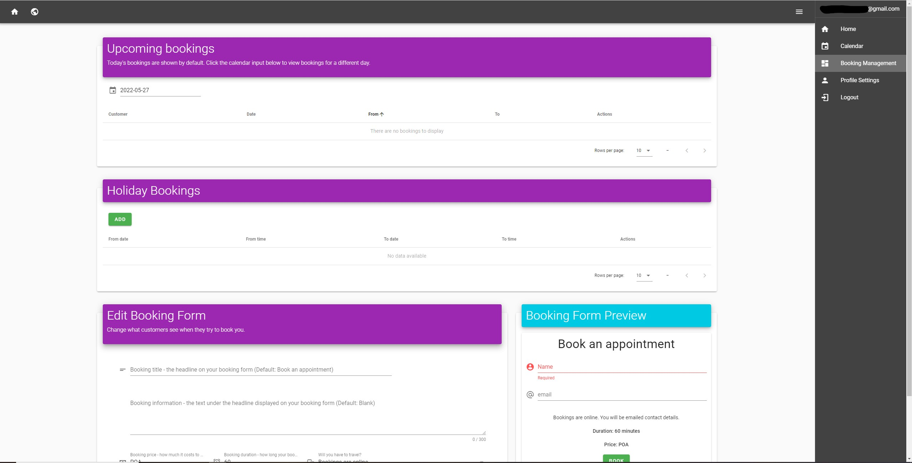
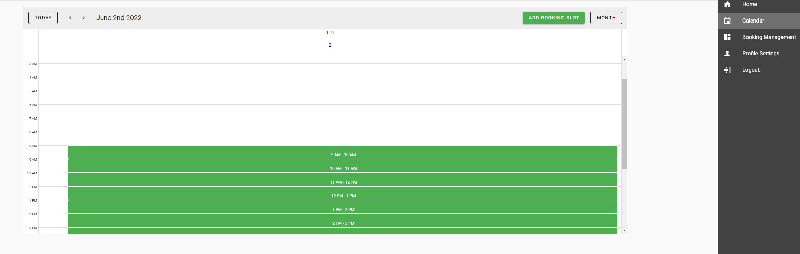
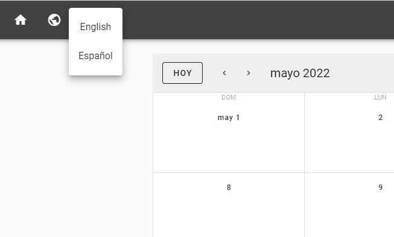

# Functionalities

## Manage your hours


## Manage your customer bookings


## Take bookings based upon your hours


## Change language between Spanish and English


# Book a Business

https://booking-calendar.web.app/about

https://booking-calendar.web.app/

Fullstack app for managing business bookings using Vue.js, Express and Firebase cloud hosting/functions.

## Complex Date-Time Logic Code Locations:

- **https://github.com/Benjy96/Vuetify-Full-Stack/blob/master/functions/routes/api/src/DateUtils.js** - determines things like "does a time intersect a range?"
- **https://github.com/Benjy96/Vuetify-Full-Stack/blob/master/functions/routes/api/src/MetaDataHelper.js** - determines things like "is a day unavailable or available?", marking dates as unavailable or available asynchronously

## Main Front-end Code:

- **https://github.com/Benjy96/Vuetify-Full-Stack/blob/master/client/src/components/Calendar.vue** - Built off Vuetify's calendar API, this presents the user with the booking calendar. It links up with my back-end API (under functions/)

## Quick Start

```bash
# Install dependencies
npm install

# Start Front-end (Vue.js): http://localhost:8081
cd client
npm run serve

# Start Server (Cloud functions): http://localhost:5000/firebase-payment-test/us-central1/app
cd functions
npm run serve

# Build for production (Will build into functions/public, ready for deployment)
cd client
npm run build

# Deploy to production (Will deploy to Firebase hosting)
cd functions
firebase deploy
```

## Run tests in front-end

If you type "vue", you will see in the list of commands:

  serve [options] [entry]                    serve a .js or .vue file in development mode with zero config

This allows us to run a JS file in the front-end.

Therefore, to run the tests:

```
cd client/src/tests
vue serve tests.js
Open browser on localhost:8081
```

### Author

Benjamin Dickey
